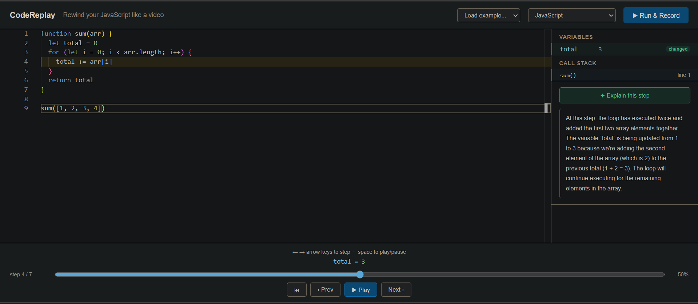

# CodeReplay

**Rewind your JavaScript execution like a video.**

CodeReplay is a browser-based debugging tool that instruments your JavaScript code using a custom Babel plugin, executes it inside a sandboxed iframe, and lets you scrub through every variable change, function call, and return value — step by step, in real time.

No backend. No install. Fully client-side.

🔗 **[Live Demo](https://codereplay.vercel.app)**

---



---

## What it does

Write any JavaScript function in the editor and click **Run & Record**. CodeReplay:

- Parses your code into an AST using Babel
- Injects `__trace()` hooks at every meaningful execution point
- Runs the instrumented code in a sandboxed iframe
- Collects a structured timeline of every event
- Lets you scrub, play, and rewind through the entire execution

At each step you see the **active line highlighted**, every **variable's live value**, the **call stack depth**, and an optional **AI explanation** of what's happening and why.

---

## How it works — the pipeline

```
User's code (string)
      ↓
@babel/parser → AST
      ↓
Custom Babel plugin → injects __trace() at every:
  • variable declaration
  • assignment expression
  • function entry
  • return statement
      ↓
@babel/generator → instrumented code string
      ↓
Blob URL → sandboxed iframe (sandbox="allow-scripts")
      ↓
Every __trace() fires postMessage → parent window
      ↓
Parent collects ordered trace array
      ↓
React state → scrubable timeline UI
```

---

## Architecture

```
src/
├── core/
│   ├── instrumentor.js   # Babel AST plugin — the hard core
│   ├── runner.js         # Sandboxed iframe execution + postMessage bridge
│   ├── timeline.js       # Snapshot reconstruction + step description
│   └── explainer.js      # Claude API integration for step explanation
├── components/
│   ├── Editor.jsx        # Monaco Editor wrapper with line decoration API
│   ├── Timeline.jsx      # Scrubber + play/pause controls
│   ├── VariablePanel.jsx # Live variable state at each step
│   ├── CallStack.jsx     # Function call depth visualization
│   ├── ErrorPanel.jsx    # Parse and runtime error display
│   └── ExplainPanel.jsx  # Claude "explain this step" UI
├── hooks/
│   └── useReplay.js      # Central state orchestrator
└── tests/
    └── instrumentor.test.js
```

**Key architectural decision:** `core/` has zero React dependency — it is pure JavaScript. This means the instrumentation logic is independently testable, reusable, and completely decoupled from the UI layer.

---

## Technical deep dive

### AST instrumentation

The `instrumentor.js` module uses `@babel/parser`, `@babel/traverse`, `@babel/generator`, and `@babel/types` to transform user code before execution.

Given this input:

```js
function sum(arr) {
  let total = 0
  return total
}
```

The plugin produces:

```js
function sum(arr) {
  __trace({ type: "fn-enter", name: "sum", args: { arr }, line: 1 });
  let total = 0;
  __trace({ type: "var", name: "total", value: total, line: 2 });
  const _ret = total;
  __trace({ type: "fn-exit", name: "sum", value: _ret, line: 3 });
  return _ret;
}
```

Key implementation details:
- `path.skip()` prevents re-traversal of injected nodes — avoids infinite loops
- `retainLines: true` in generate keeps original line numbers intact for editor highlighting
- `for` loop initialisers are explicitly skipped — `insertAfter` is illegal in that position
- Expression-body arrow functions are skipped — no block to inject into
- Internal variables are filtered from the variable panel using a `_` prefix guard

### Sandboxed execution

Instrumented code runs in an iframe with `sandbox="allow-scripts"` — the most restrictive sandbox that still allows JavaScript. The iframe has no access to:
- Parent DOM
- Network (no fetch, XHR)
- localStorage / cookies
- Parent window scope

Communication is strictly one-way via `postMessage`. All values are serialised to strings inside the iframe before posting — functions become `[Function]`, circular objects become `[unserializable]`.

A 5-second execution timeout handles infinite loops. Execution is capped at 1,000 trace events to handle large loops gracefully.

### Timeline reconstruction

The trace array is **immutable**. Variable state at any step N is reconstructed by a left fold over events 0..N — the same pattern Redux uses for state derivation from actions.

```js
// getVariableState — O(n) left fold
for (let i = 0; i <= upToStep; i++) {
  if (event.type === 'var' || event.type === 'assign') {
    state[event.name] = { value: event.value, changedAtStep: i }
  }
}
```

This means scrubbing is non-destructive — you can jump to any step instantly without maintaining a mutable state machine.

### Line highlighting

Monaco Editor exposes a `deltaDecorations` API that applies CSS classes to specific line ranges programmatically. At each step, we compute the active line from the current trace event and apply a highlight decoration — same mechanism VS Code uses for debugger stepping.

---

## Running locally

```bash
git clone https://github.com/Debojyoti-Koley/codeReplay.git
cd codereplay
npm install
```

Create a `.env` file in the project root:

```
VITE_CLAUDE_API_KEY=sk-ant-your-key-here
```

Get your key from [console.anthropic.com](https://console.anthropic.com). The "Explain this step" feature requires a valid key. All other features work without it.

```bash
npm run dev
```

Open `http://localhost:5173`.

---

## Running tests

```bash
npm run test
```

25 tests across 5 suites:

| Suite | What it covers |
|---|---|
| `instrumentor — parse errors` | Invalid JS returns structured error, never crashes |
| `instrumentor — variable tracing` | `let`, `const`, `for` loop guards, internal variable filtering |
| `instrumentor — function tracing` | `fn-enter`, `fn-exit`, nested functions, arrow functions |
| `timeline — getVariableState` | Left fold correctness, step isolation, changedAtStep tracking |
| `timeline — getCallStack` | Push on enter, pop on exit, nested call depth |

---

## Supported JavaScript

CodeReplay handles synchronous pure JavaScript:

- Variable declarations (`let`, `const`, `var`)
- Assignment expressions
- Named functions and block-body arrow functions
- Nested and recursive functions
- `for`, `while` loops
- All standard JS expressions and operators

**Out of scope (by design):**

- `async/await`, Promises
- `fetch`, `setTimeout`, DOM APIs
- ES modules (`import/export`)
- TypeScript, Python — plugin architecture designed for extension (roadmap)

---

## Tech stack

| Layer | Technology |
|---|---|
| UI framework | React 18 + Vite |
| Code editor | Monaco Editor (`@monaco-editor/react`) |
| AST parsing | `@babel/parser` |
| AST traversal | `@babel/traverse` |
| Code generation | `@babel/generator` |
| AST node building | `@babel/types` |
| Sandboxed execution | iframe + postMessage |
| AI explanation | Claude API (`claude-haiku-4-5`) |
| Testing | Vitest |
| Deployment | Vercel |

---

## Roadmap

- [ ] TypeScript support
- [ ] Python support via Pyodide
- [ ] Shareable replay URLs
- [ ] React Native mobile companion app
- [ ] Breakpoint support — pause execution at a specific line
- [ ] Expression-body arrow function tracing

---

## License

MIT
